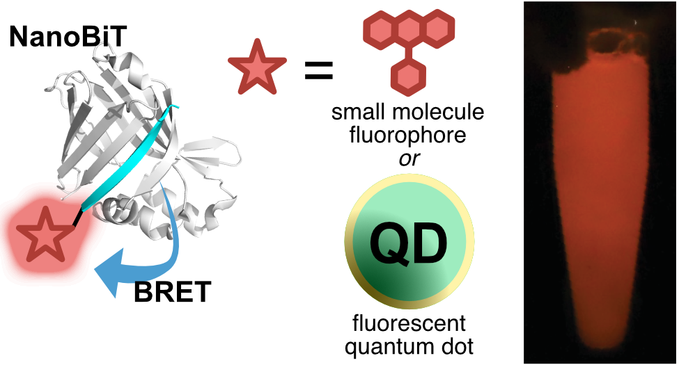

# NanoBiT-BRET

  

## `notebook/` folder

Jupyter notebooks for calculating BRET efficiency, visualizing spectral data and tissue mimic experiments.

## `data/` folder

**`mimic_tissue_experiment.csv`** 
- Contains experimental data for tissue mimic experiments
- Samples include: NanoBiT, NanoBiT-Cou343, NanoBiT-FAM, NanoBiT-TAMRA

**`lum_count_fluor_NanoBiT.csv`** 
- Luminescence count data for fluorophore-NanoBiT samples

**`spectra_fluor_nanobits.csv`**
**`spectra_fluor_nanobits_normalized.csv`** 
- (Normalized) spectral data for fluorophore-NanoBiT samples

**`spectra_fluor_linker_nanobits.csv`** 
- Spectral data for fluorophore-linker-NanoBiT samples

**`spectra_quantum_dots_nanobits.csv`**
- Spectral data for quantum dots NanoBiT samples

